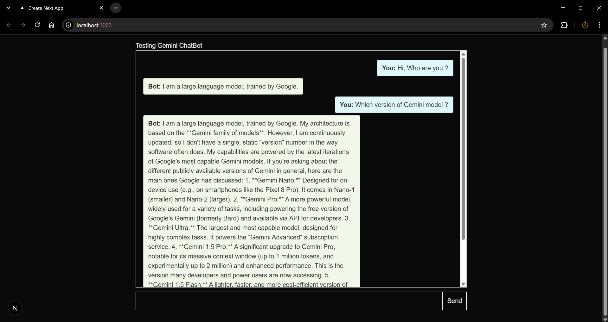

 # Learning to Integrate ChatBot's in Next.js

 This project is a simple example for learning how to integrate a generative AI chatbot (Google Gemini) in a Next.js application.
#



## Features

- Simple chat UI with user and bot message alignment
- API route for Gemini chatbot integration
- Styled chat bubbles and responsive layout

## Getting Started

1. Clone this repository.
2. Install dependencies:
   ```bash
   npm install
   ```
3. Add your Gemini API key to your environment variables:
   - Create a `.env.local` file
   - Add: `NEXT_PUBLIC_GEMINI_API_KEY=your_api_key_here`
4. Run the development server:
   ```bash
   npm run dev
   ```
5. Open [http://localhost:3000](http://localhost:3000) to view the chatbot.

## Learning Goals

- Understand how to connect a Next.js frontend to a generative AI backend
---

